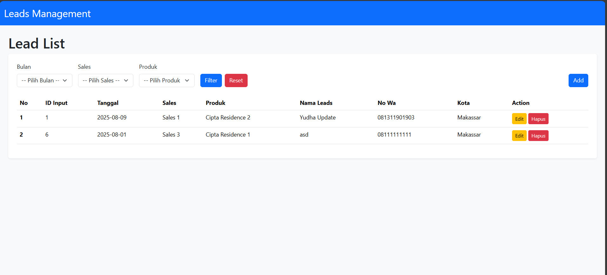
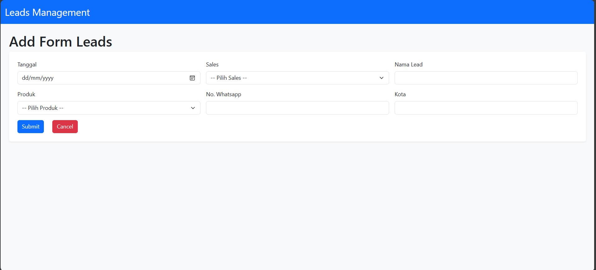
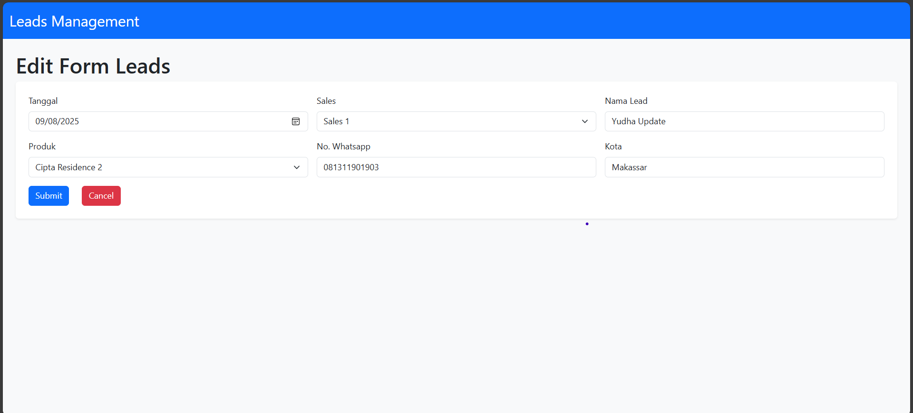

Mini Leads Management
--

- Setup Project
1. Clone Project Github in your xampp/laragon path
2. Running Database.sql in your MYSQL
3. Update Database.php config with your config localhost
4. run "composer install". if you dont have composer, this is link for the installer https://getcomposer.org/download/
5. running index.php in path "public/index.php"

Preview
--

